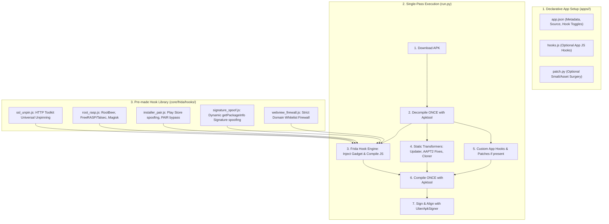

# Architecture & Implementation Plan: Frida-First Universal Hooking Pipeline

## 1. Executive Summary

This document defines the final engineering specification for overhauling the APK editing and CI build pipeline in `bit-updates`.

### Core Problems Solved:
1. **Developer Overhead**: Eliminate repetitive, brittle Smali reverse engineering by adopting **Frida Gadget** as the primary, general patcher. Standard security checks (SSL Pinning, RootBeer, FreeRASP, Google Play installer verification, PAIR license checks, WebView firewalls) are handled by battle-tested, version-independent JavaScript hooks.
2. **CI Build Performance Bottleneck**: Eliminate redundant `apk-mitm` decompile/compile cycles and Node.js setup in GitHub Actions. Transform the build flow into a **Single-Pass Pipeline** (`Download` $\rightarrow$ `Decompile ONCE` $\rightarrow$ `Inject Frida & Static Transforms` $\rightarrow$ `Compile ONCE` $\rightarrow$ `Sign`), reducing CI build time per app from ~5 minutes to **~45–60 seconds**.

---

## 2. System Architecture



---

## 3. Subsystem Specifications

### A. Frida Gadget Subsystem (`core/frida/`)

#### 1. Binary Management & Injection (`core/frida/gadget.py`)
- **Binary Source**: Caches official `libfrida-gadget.so` for all Android ABIs (`arm64-v8a`, `armeabi-v7a`, `x86_64`, `x86`).
- **ABI Detection**: Scans `decompiled_dir/lib/`. If no native libraries exist (pure Java/Kotlin app), injects `arm64-v8a` and `armeabi-v7a`.
- **Stealth Placement**: Renames the binary to `libgadget.so` and writes `libgadget.config.so` pointing to `gadget_hooks.js` in `script` mode.
- **Loader Injection**:
  - Automatically identifies the `Application` class or main launcher `Activity` in `AndroidManifest.xml`.
  - Injects `System.loadLibrary("gadget")` into `Application.<clinit>` or `MainActivity.onCreate` / `attachBaseContext`.

#### 2. Pre-made Hook Modules (`core/frida/hooks/`)
- **`ssl_unpin.js`** (Sourced from *HTTP Toolkit / Tim Perry*):
  - Bypasses OkHttp 3 & 4 `CertificatePinner`, Android `TrustManagerImpl`, `Conscrypt.verifyChain`, `TrustKit`, OpenSSLSocketImpl, Apache Cordova.
- **`root_rasp.js`** (Sourced from *RootBeer & Talsec Community Bypasses*):
  - Overrides `com.scottyab.rootbeer.RootBeer.isRooted*` to return `false`.
  - Disarms `com.aheadtec.talsec.security.Talsec.start()`.
  - Hooks `File.exists` and `Runtime.exec` for `/system/bin/su`, `/sbin/su`, `magisk`.
  - Spoofs `Build.TAGS` to `"release-keys"`.
- **`installer_pair.js`**:
  - `ApplicationPackageManager.getInstallerPackageName` $\rightarrow$ returns `"com.android.vending"`.
  - `PackageManager.getInstallSourceInfo` (Android 11+) $\rightarrow$ returns mock `InstallSourceInfo` with `"com.android.vending"`.
  - `com.pairip.licensecheck.LicenseClient.checkLicense` $\rightarrow$ no-op.
  - Kotlin `ArraysKt.contains` on installer list $\rightarrow$ returns `true`.
- **`signature_spoof.js`** (Sourced from *lemon4ex/frida-signature-bypass*):
  - Hooks `PackageManager.getPackageInfo` to dynamically inject the original APK's signature certificate into `PackageInfo.signatures` and `SigningInfo`.
- **`webview_firewall.js`** (Pure Domain Whitelist Firewall):
  - Intercepts `WebViewClient.shouldOverrideUrlLoading` (both `WebResourceRequest` and `String` overloads).
  - Matches destination URLs against `allowed_domains`. If blocked: cancels navigation and shows a native Android Toast (`"הגישה לקישור זה נחסמה"`).
  - No DOM injection or page alteration.

#### 3. Hook Compiler (`core/frida/builder.py`)
- Reads `app.json` configuration.
- Merges active hook modules from `core/frida/hooks/` + any custom `apps/<app>/hooks.js`.
- Writes the final bundled `gadget_hooks.js` payload.

---

### B. Static Transformers & Resilience Pass (`core/patcher.py`)
Executed inside the single decompilation pass alongside Frida:
1. **Universal In-App Auto-Updater (`core/universal_updater.py`)**:
   - Injects `storeautoupdater` smali classes to highest `smali_classesN`.
   - Injects `provider_paths.xml` into `res/xml/` and FileProvider/Service into `AndroidManifest.xml`.
   - Injects `storeautoupdater.Updater.check(context)` into the launcher Activity.
2. **AAPT2 Resilience**:
   - Strips `recreateOnConfigChanges` from `AndroidManifest.xml` (fixes API 37 crash).
   - Strips `android:layout_gravity="0x0"` from `res/layout/*.xml` (fixes strict AAPT2 syntax errors).
   - MultiDex 64k auto-rebalancer: shifts heavy packages (`kotlin`, `okhttp3`) to `smali_classes2+` if `smali/` exceeds method limits.
3. **Package Cloner (`core/cloner.py`)**:
   - Applies package rename in Manifest, `apktool.yml`, component names, authorities, and app title suffix when `clone_config` is defined.
4. **Hotfixes & Overrides (`core/hotfix.py`)**:
   - Applies `version_overrides`, `version_code_overrides`, and `hotfixes` suffix.
5. **Escape Hatch (`apps/<app>/patch.py`)**:
   - Runs custom smali/asset surgery if present (e.g. WhatsApp UI tab removal, Spotify media worker removal).

---

## 4. Declarative `app.json` Schema

### Standard App (Zero Custom Code Needed):
```json
{
  "metadata": {
    "id": "bezeq",
    "name": "בזק Bezeq",
    "package_name": "il.co.bezeq.my",
    "category": "Communication"
  },
  "source": {
    "source": "apkeep",
    "name_play": "בזק Bezeq"
  },
  "patching": {
    "inject_updater": true
  },
  "paths": {
    "version_file": "apps/bezeq/version.txt",
    "status_file": "apps/bezeq/status.json"
  },
  "maintenance": {
    "maintainer": "cfopuser"
  }
}
```
*The Frida engine automatically injects universal SSL unpinning, RootBeer/FreeRASP bypass, Play Store installer spoofing, and PAIR bypass by default!*

### Configured App (e.g. Custom WebView Whitelist or Cloned App):
```json
{
  "metadata": {
    "id": "metrolist",
    "name": "MetroList",
    "package_name": "com.metrolist.music"
  },
  "source": {
    "source": "github",
    "repo": "vfsfitvnm/ViMusic"
  },
  "patching": {
    "inject_updater": true,
    "frida": {
      "webview_firewall": {
        "allowed_domains": ["accounts.google.com", "open.spotify.com"]
      }
    },
    "string_replacements": [
      {
        "key": "stands_with_palestine",
        "values": {
          "he": "🇮🇱 !!!עם ישראל חי 🇮🇱",
          "default": "🇮🇱 Am Yisrael Chai!!! 🇮🇱"
        }
      }
    ]
  }
}
```

---

## 5. CI Workflow Overhaul (`.github/workflows/apk_patcher.yml`)

### Eliminated from CI:
- `actions/setup-node@v4`
- `git clone https://github.com/cfopuser/apk-mitm.git && npm install ...`
- The `apk-mitm` decompile/compile cycle
- Dynamic tool downloading in build matrix jobs

### Optimized CI Steps:
```yaml
- name: Setup Java & Python
  uses: actions/setup-java@v4
  with: { distribution: 'temurin', java-version: '17' }

- name: Cache Tools & Gadgets
  uses: actions/cache@v4
  with:
    path: |
      /usr/local/bin/apktool.jar
      /usr/local/bin/ubersigner.jar
      core/frida/bin/
    key: tools-${{ runner.os }}-v1

- name: Check for updates & download
  run: python run.py --app ${{ matrix.app }} --step download

- name: Decompile APK (Single-Pass)
  if: steps.check_version.outputs.update_needed == 'true'
  run: java -jar /usr/local/bin/apktool.jar d -f latest.apk -o build_output

- name: Apply Frida & Static Patches
  if: steps.check_version.outputs.update_needed == 'true'
  run: python run.py --app ${{ matrix.app }} --step patch

- name: Repack APK (Single-Pass)
  if: steps.check_version.outputs.update_needed == 'true'
  run: java -jar /usr/local/bin/apktool.jar b build_output -o patched_unsigned.apk

- name: Sign APK
  if: steps.check_version.outputs.update_needed == 'true'
  run: java -jar /usr/local/bin/ubersigner.jar -a patched_unsigned.apk ...
```

---

## 6. Implementation Roadmap

### Phase 1: Frida Subsystem
1. Create `core/frida/` directory structure.
2. Implement pre-made hook modules:
   - `core/frida/hooks/ssl_unpin.js`
   - `core/frida/hooks/root_rasp.js`
   - `core/frida/hooks/installer_pair.js`
   - `core/frida/hooks/signature_spoof.js`
   - `core/frida/hooks/webview_firewall.js`
3. Implement `core/frida/builder.py` (hook compiler and packager).
4. Implement `core/frida/gadget.py` (gadget binary downloader, stealth renaming, and smali `loadLibrary` injector).

### Phase 2: Pipeline Integration & Static Transformers
1. Wire `core/frida/` into `core/patcher.py`.
2. Integrate AAPT2 resilience cleaner (stripping `recreateOnConfigChanges` and `layout_gravity="0x0"`) into `core/patcher.py`.
3. Update `run.py` to remove external `apk-mitm` and run the single-pass flow.
4. Clean up `core/utils.py` (remove `run_apk_mitm` subprocess wrapper).

### Phase 3: CI Workflow Update
1. Update `.github/workflows/apk_patcher.yml` to remove Node.js and `apk-mitm` steps.
2. Add caching for `apktool.jar`, `ubersigner.jar`, and Frida Gadget binaries.

### Phase 4: App Cleanups & Simplification
1. Clean up `apps/spotify/patch.py` (remove duplicated updater code).
2. Simplify standard apps (`bezeq`, `bit`, `egg`, `hopon`, `mizrahi`, `osmand`, `sealplus`, `termux`, `waze`) to rely on the general Frida engine.

### Phase 5: Automated Testing & Verification
1. Create unit tests in `tests/`:
   - `test_frida_builder.py`
   - `test_frida_gadget.py`
   - `test_patcher_integration.py`
2. Run test suite: `python -m unittest discover tests`.
3. Verify local build of sample apps (`bit`, `bezeq`, `spotify`, `metrolist`).
